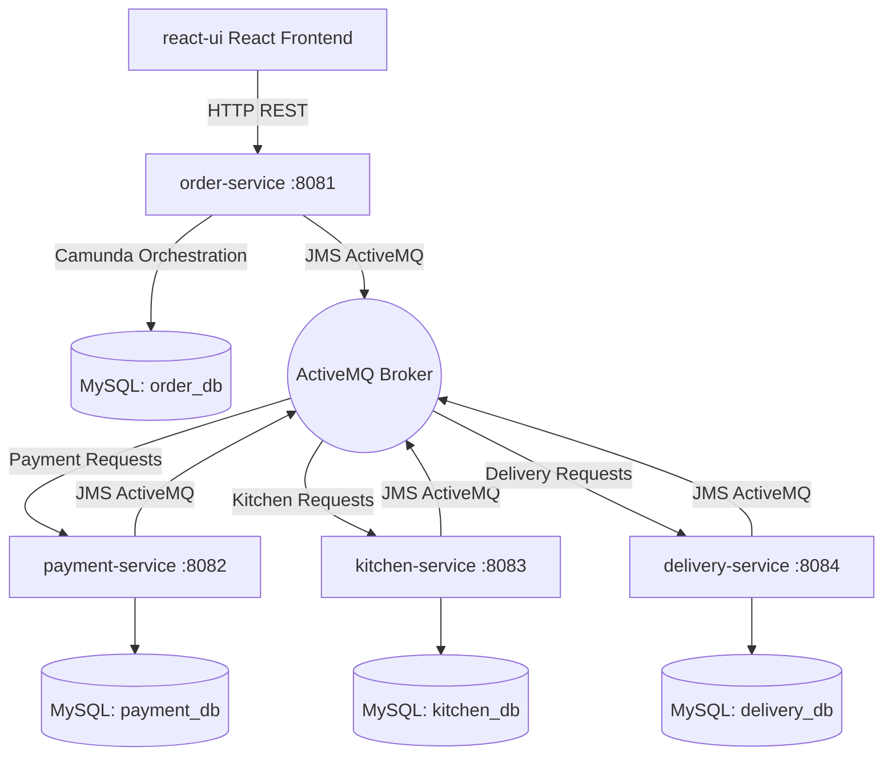

# Gourmet Express: Online Food Order Processing System

Gourmet Express is a modern, premium multi-module microservices food ordering application. It orchestrates the lifecycle of an order using **Camunda BPMN 7** and communicates asynchronously between services using **JMS ActiveMQ**. It features a stunning, state-of-the-art **React + Vite** frontend designed with custom CSS (glassmorphism/dark mode) and **Lucide Icons**.

---

## 🏗️ Architecture



The system is split into four distinct backend Spring Boot services and one React frontend:
1. **`order-service` (Port 8081)**: Manages customer orders and hosts the Camunda BPMN process engine to orchestrate the lifecycle steps.
2. **`payment-service` (Port 8082)**: Performs payment simulation, communicating requests and responses over ActiveMQ.
3. **`kitchen-service` (Port 8083)**: Manages chef dashboards, order preparation status, and food-ready alerts.
4. **`delivery-service` (Port 8084)**: Tracks courier dispatch, location tracking simulation, and final delivery updates.
5. **`react-ui` (React, Vite)**: The premium customer & restaurant management client.

---

## 🛠️ Technology Stack

* **Backend Framework**: Spring Boot 3.3.1
* **Workflow Engine**: Camunda BPMN Starter 7.22.0
* **Messaging Broker**: Apache ActiveMQ (JMS)
* **Database**: MySQL (Connector J, Spring Data JPA)
* **Frontend**: React 18.3, Vite 5.3, Lucide Icons, Axios
* **Styling**: Vanilla CSS (Tailored dark glassmorphic design)
* **Build Tools**: Maven (Java 21) & npm

---

## 🚀 Getting Started (Run Locally)

### 1. Prerequisites
Ensure you have the following installed and running on your system:
* **Java 21** & **Maven**
* **Node.js** & **npm**
* **MySQL Server** (running on port `3306`)
* **Apache ActiveMQ** (running on port `61616`)

### 2. Database Setup
Create the four databases in MySQL. You can use the provided [schema.sql](schema.sql) file or run:
```sql
CREATE DATABASE IF NOT EXISTS order_db;
CREATE DATABASE IF NOT EXISTS payment_db;
CREATE DATABASE IF NOT EXISTS kitchen_db;
CREATE DATABASE IF NOT EXISTS delivery_db;
```
*Note: Make sure your MySQL root user credentials match `root`/`root` as defined in `application.yml` files, or update the credentials accordingly.*

### 3. Run ActiveMQ
Start your local ActiveMQ broker. By default, it runs at `tcp://localhost:61616`.

### 4. Build and Run Backend Services
You can build and package the entire multi-module Maven project from the root folder:
```bash
mvn clean install
```
Then, start each microservice by running their respective application classes or executable JARs:
```bash
# In separate terminals:
mvn -pl order-service spring-boot:run
mvn -pl payment-service spring-boot:run
mvn -pl kitchen-service spring-boot:run
mvn -pl delivery-service spring-boot:run
```

### 5. Run the React Frontend
Navigate to the `react-ui` folder, install dependencies, and start the development server:
```bash
cd react-ui
npm install
npm run dev
```
Open [http://localhost:5173](http://localhost:5173) in your browser to view the application.

---

## ☁️ Deploying Frontend to Netlify

The frontend is structured in the `react-ui` folder. A `netlify.toml` file is configured at the repository root to automatically direct Netlify to install dependencies and build from the `react-ui` directory.

### To Deploy:
1. Push this project code to a public/private GitHub repository.
2. Sign in to [Netlify](https://www.netlify.com/).
3. Click **Add new site** -> **Import an existing project**.
4. Select **GitHub** and authorize access to your repository.
5. Netlify will automatically detect the settings from `netlify.toml`:
   * **Base directory**: `react-ui`
   * **Build command**: `npm run build`
   * **Publish directory**: `react-ui/dist`
6. Click **Deploy Site**.
7. If your Spring Boot backend microservices are hosted on the cloud (e.g. Render, AWS, Heroku), you can define environment variables in Netlify (**Site settings -> Environment variables**) to point the frontend to your live APIs:
   * `VITE_ORDER_API_URL`: URL of your live Order Service API
   * `VITE_KITCHEN_API_URL`: URL of your live Kitchen Service API
   * `VITE_DELIVERY_API_URL`: URL of your live Delivery Service API

---

## 📝 BPMN Workflow Lifecycle
The `order-processing.bpmn` workflow orchestrates the following order steps:
1. **Start**: Order creation event.
2. **Authorize Payment**: Order service sends a JMS message to the `payment-requests` queue. The payment-service processes the request and replies back to `payment-responses`.
3. **Send to Kitchen**: Order service sends a request to the `kitchen-requests` queue. The restaurant cooks update the status on their dashboard which fires a callback to `kitchen-responses`.
4. **Deliver Order**: Order service sends a request to `delivery-requests`. A courier picks up the order, simulates delivery, and correlates back to `delivery-responses`.
5. **Complete**: Order is marked completed and status is updated.
