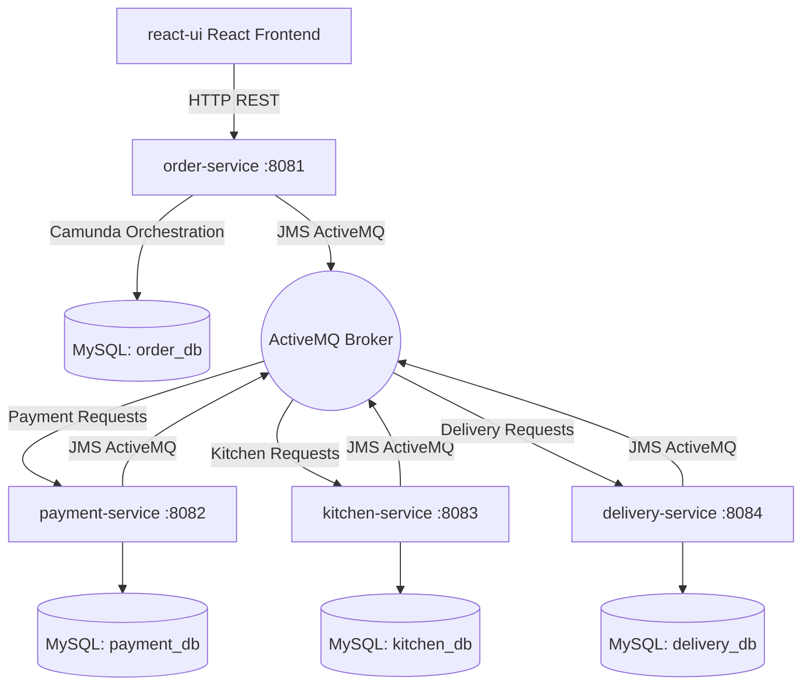

# Online Food Order Processing System Structure Plan

This plan details the folder structure, Maven configuration files, and starter classes for the multi-module microservices system.

## Proposed Architecture

We will create a multi-module Maven project where `order-service`, `payment-service`, `kitchen-service`, and `delivery-service` are Maven submodules, and `react-ui` is a sibling frontend directory.

---

## Proposed Changes

### Parent and Microservices (Java 21, Spring Boot 3.3.1, Camunda 7.22.0)

We will create the parent POM and subdirectories for the 4 microservices.

#### [NEW] [pom.xml](file:///c:/Users/vc/Desktop/online%20food%20order%20app/pom.xml)
Root parent POM managing versions:
- Java 21
- Spring Boot 3.3.1
- Camunda 7.22.0
- MySQL Connector J (managed by Boot)
- Spring Boot ActiveMQ (managed by Boot)
- Lombok 1.18.32

#### [NEW] [order-service](file:///c:/Users/vc/Desktop/online%20food%20order%20app/order-service)
Handles ordering APIs and hosts the **Camunda BPMN engine** to orchestrate the lifecycle of an order:
1. **Order Received** -> Persistence (MySQL).
2. **Process Payment** -> Send message to ActiveMQ (`payment-requests`), wait for correlation (`payment-responses`).
3. **Send to Kitchen** -> Send message to ActiveMQ (`kitchen-requests`), wait for correlation (`kitchen-responses`).
4. **Request Delivery** -> Send message to ActiveMQ (`delivery-requests`), wait for correlation (`delivery-responses`).
5. **Order Completed** -> Update order status to DELIVERED.

We will provide:
- `pom.xml` with `camunda-bpm-spring-boot-starter-webapp` and ActiveMQ.
- `OrderServiceApplication.java` main class.
- Configuration classes for Camunda and ActiveMQ.
- A functional placeholder `order-processing.bpmn` workflow file in `src/main/resources/processes/`.
- Entities: `Order`, `OrderStatus`.
- Controllers and services for starting processes and retrieving order status.
- Camunda Java Delegates for publishing tasks to ActiveMQ.

#### [NEW] [payment-service](file:///c:/Users/vc/Desktop/online%20food%20order%20app/payment-service)
Processes customer payments. Listening on ActiveMQ queue `payment-requests` and publishing to `payment-responses`.
We will provide:
- `pom.xml` with activemq, jpa, mysql.
- `PaymentServiceApplication.java` and ActiveMQ listener configuration.
- Entities: `Payment` (saving records in `payment_db`).
- Services for simulating successful transactions.

#### [NEW] [kitchen-service](file:///c:/Users/vc/Desktop/online%20food%20order%20app/kitchen-service)
Manages restaurant order preparation. Listening on queue `kitchen-requests` and publishing to `kitchen-responses`.
We will provide:
- `pom.xml` with activemq, jpa, mysql.
- `KitchenServiceApplication.java` and ActiveMQ listener configuration.
- Entities: `KitchenOrder`.

#### [NEW] [delivery-service](file:///c:/Users/vc/Desktop/online%20food%20order%20app/delivery-service)
Manages courier dispatch and delivery tracking. Listening on queue `delivery-requests` and publishing to `delivery-responses`.
We will provide:
- `pom.xml` with activemq, jpa, mysql.
- `DeliveryServiceApplication.java` and ActiveMQ listener configuration.
- Entities: `Delivery`.

---

### Frontend (React UI)

#### [NEW] [react-ui](file:///c:/Users/vc/Desktop/online%20food%20order%20app/react-ui)
A standalone Vite React client structured beautifully with Vanilla CSS:
- `package.json` with React, Vite, Lucide Icons (for premium visual elements), and standard scripts.
- `vite.config.js` and `index.html`.
- `src/main.jsx` and `src/App.jsx`.
- `src/index.css` - Custom styling theme (luxurious dark/glassmorphic theme).
- `src/components/` - Nav, OrderTracker (stepper displaying Camunda state).
- `src/pages/` - Home (menu selector), Checkout, TrackerPage.
- `src/services/` - `api.js` for calling the order-service API.

---

## Verification Plan

### Automated Build Verification
We will run `mvn clean compile` from the workspace root to ensure all Java microservices compile correctly and their POM dependency declarations are sound.

### Manual Verification
- We can inspect the generated files to ensure correct package declaration, imports, and properties.
- Verify that standard configuration defaults point to:
  - MySQL: `localhost:3306` with correct database suffixes (e.g. `order_db`).
  - ActiveMQ: `tcp://localhost:61616`.
- Verify the BPMN file compiles and is syntactically valid XML.
