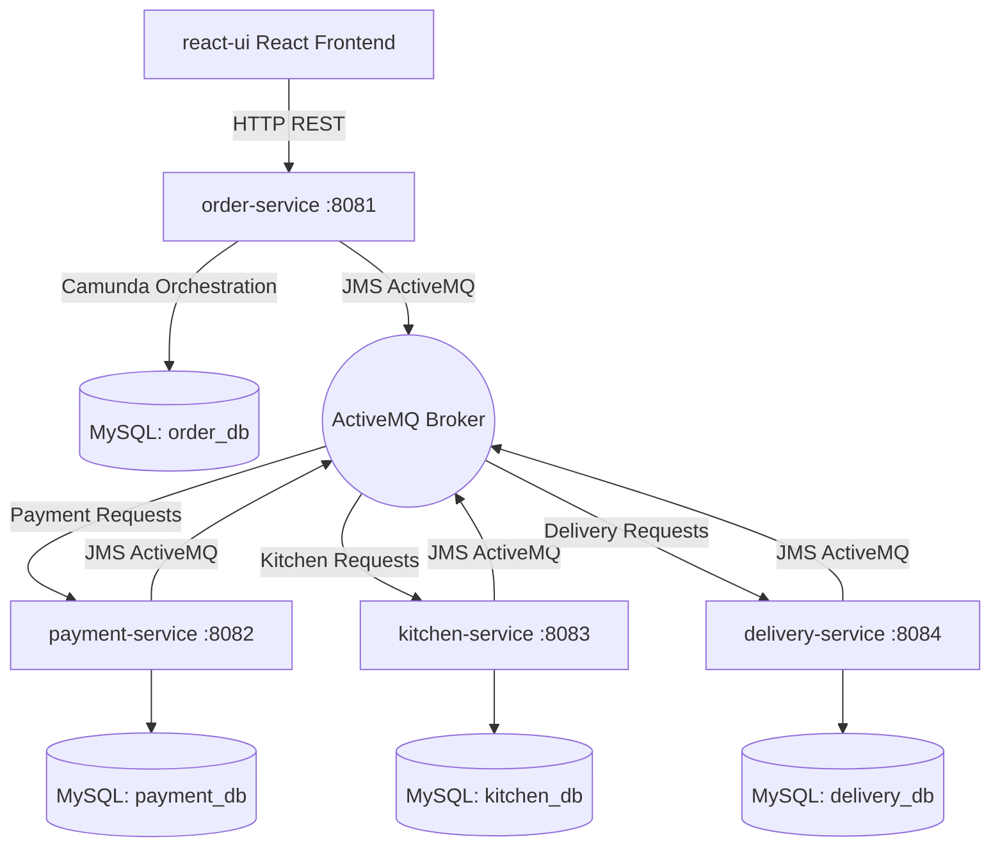

# AI-Generated Project Implementation Report

## 1. Project Overview & Scope
Gourmet Express is an asynchronous, event-driven, multi-module microservices food ordering application designed to orchestrate complex order lifecycles. It utilizes modern industry-standard patterns to separate concerns across functional domain boundaries while maintaining consistency through orchestration.

The system supports real-time customer menu selection, custom checkout validations, payment gateway simulations, active kitchen ticket preparation tracking, and rider dispatch tracking.

---

## 2. Technical Stack
* **Java Version**: JDK 21
* **Backend Framework**: Spring Boot 3.3.1 (Spring Data JPA, Spring Web)
* **Workflow Orchestration**: Camunda Engine Starter 7.22.0
* **Messaging Middleware**: Apache ActiveMQ 6.x (JMS)
* **Databases**: MySQL 8.x (using Database-per-Service isolation)
* **Frontend Web Application**: React 18.3, Vite 5.3, Lucide Icons, Axios
* **Styling & Theme**: Vanilla CSS (Tailored dark glassmorphic design)
* **Cloud Hosting**: Netlify (Frontend) and Docker-based container services (Backend)

---

## 3. Architecture Blueprint

* **Frontend (`react-ui`)**: A client interface hosted live on Netlify. It features custom customer checkout screens, a live status tracker stepper that polls Camunda workflow variables, and a restaurant dashboard for mock operations.
* **Order Service (`order-service`)**: Serves as the central API gateway and orchestrator. It manages the Camunda BPMN engine lifecycle.
* **Payment Service (`payment-service`)**: Listens on the `payment-requests` queue, executes payment simulation logic, logs details to `payment_db`, and responds on `payment-responses`.
* **Kitchen Service (`kitchen-service`)**: Listens on `kitchen-requests`, creates kitchen order preparation tickets, and updates cooking progress.
* **Delivery Service (`delivery-service`)**: Listens on `delivery-requests`, coordinates rider dispatch simulation, and manages delivery-completed events.

---

## 4. End-to-End Execution Sequence
1. **Order Initiation**: The customer places an order via the React client, which triggers a `POST` request to `order-service` and initializes the Camunda process workflow instance.
2. **Payment Step (Asynchronous)**: Camunda triggers the `ProcessPaymentDelegate` java class, which posts a request to the `payment-requests` ActiveMQ queue. The payment-service processes the payment and publishes a status response to the `payment-responses` queue.
3. **Kitchen Ticket (Asynchronous)**: Once payment succeeds, the workflow moves to the `SendToKitchenDelegate` which publishes a message to `kitchen-requests`. Restaurant staff view this order on their portal, mark it as `PREPARING` and then `READY`. This sends a readiness message to `kitchen-responses`.
4. **Courier Delivery (Asynchronous)**: The workflow advances to `RequestDeliveryDelegate` which publishes to `delivery-requests`. A courier accepts the order, changes status to `OUT_FOR_DELIVERY` and then `DELIVERED`, sending a confirmation message back to `delivery-responses`.
5. **Workflow End**: The Camunda workflow reaches its finish node. The database order status is updated to `DELIVERED`, and the React frontend stepper reaches 100% completion.

---

## 5. Deployment Information
* **Frontend Hosting**: Live on Netlify at `https://foodorderapp1106.netlify.app/`
* **Netlify Build Settings**: Configured using `netlify.toml` in the repository root for Vite automatic sub-directory builds.
* **Backend Database**: Managed using TiDB Serverless Cloud (MySQL compatible) on Port 4000.
* **Deployment Packaging**: Containerized using multi-stage Docker configurations at the root (`Dockerfile`).
